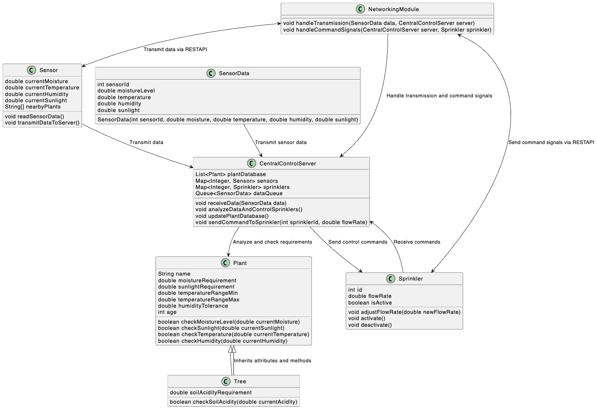

# The Irrigation System

### Functional Requirements 
- Soil Moisture Monitoring:
   - To ensure optimal hyderation for various plant species, Sensors must accuratly measure soil moisture levels. 
- Environmental Data Collection: 
   - Recording temperature, humidity, and sunlight intensity using sensros to inform irrigation decisions. 
- Plant Identification
  - To create the irrigation schedules, the system must identify plant species and their locations.
- Automated Watering Control: 
  - Sprinklers should adjust water flow based on the sensor data to meet specific plant needs.
- Data Communication: 
  - A central computer system is required to retrieve sensors and sprinklers data for analysis and control.
- User Interface: 
  - Provide a user-friendly interface for monitoring system status and manual adjustments.

### Non-Functional Requirements 
- Reliability: 
  - To ensure minimal downtime.
- Scalability: 
  - Design the system in a way to accommodate future expansion.
- Security: 
  - Protect system from unauthorized access and data breaches.
- Maintainability: 
  - Facilitate easy maintenance and updates to hardware and software components.
- Environmental Resistance: 
  - Ensure the sensors and sprinklers can tolerate Dubai's weather conditions, including high temperature and sand exposure.

### Implementation Requirements
- Hardware: 
  - Sensore and sprinklers must align with the environmental conditions and capable of the required measurements and controls.
- Networking Infrastructure: 
  - A reliable communication networking system between devices and the central system.  
- Software Development: 
  - Develop software for data-processing, decision-making and user interaction.
- Integration: 
  -  for cohesive operation all components of the system needs to be integrated seamlessly.

### Scope Consideration: 

### triple constraints.

# Computerized Control

To control the sensors and sprinlkers in effectively in this system

1. Networking Communication
   - Wireless Communication: Using protocols such as Wi-Fi to connect sensors and sprinklers to central control system. This would provide flexibility and easy installation especially in expensive areas like gardens and orchards.

   - Network Reliability: To ensure consistent communication even in situations when devices fails or signal interference, redundancy and error-handling is implemented.

2. Inter-Process Communication (IPC) Mechanism

   - Embedded Controllers:
     -  Each sensor and sprinkler is equiped with microcontrollers which would enable processing data and executing commands. This decentralized approach enhances system responsiveness and reliability.
      -  To achieve this, we can use a lightweight IPC like message queues or shared memory. 
      - Using IPC liberaries provided bt RTOS such as FreeRTOS queue functions to enable data exchange between tasks within each microcontroller, allowing sensors to send data to processing task and receive commands back from the control logic. 
      Data collection task reads sensor data and places it into a message queue, the processing task then retrieves data from the queue and sends appropriate signal to the command task. the command task adjust the sprinkler flow rate based on the received data and instructions. 

    - Central Control Unit:
       -  A central server or control unit is used to analyze environmental conditions, collect data from all the devices, and make informed irrigation decisions.
      - Sensors, sprinklers and central server will communicate using RESTful APIs in which the Central server will host a REST API endpoint to handle incoming sensor data and provide control commands. The embedded devices the the HTTP client libraries to send data as POST request and receive GET request for control commands. 
      RESTful APIs are easy to develop, and they are stateless in nature which would reduce server load and allows better distribution of tasks. It also provide a secure communication between devices and the server. 

      - Sensors send HTTP POST requests with data of moisture, temperature, humidity and sunlight level to the central server. 
      the central server processes data and sends HTTP responses using GET requests to the sprinkler systems.
      To ensure that the irrigation settings are optimal, devices check for updates or control commands periodically.  
    
    - Data Logging and Sychronization: 
      - To Share data between server processes internally, tools like POSIX shared memory, pipes, or sockets can be used , which handles sensor data, analytics, and command dispatching.

      - To manage the processes efficiently, implement multithreading or multiprocessing where main data handling runs separalty from background taks such as data logging or user notifications.
       
- Triple Consideration: 
   - Cost Reduction: REST are widely used therefore tools and libraries are available. Moreover, the use of open-source OS lowers software costs significantly. 
 

3. Operating System: 
    
   - Real-time Operating System (RTOS):
     -  In order to handle time-sensitive tasks efficiently, using a real-time OS like RTOS for embedded devices. 
     - RTOS like FreeRTOS are lightweight, open-source, and have the ability to handle time-sensitive tasks which is essential for real-time sensor data processing and sprinkler control. Additionally, RTOS ensure that tasks are completed in predictable time contraint which is crucial for responsive irrigation. 
     RTOS also require low power, which is important for sensors operating in remote garden areas where battery life is crucial.
    
   - Linux-Based Systems: 
      - For the central control unit, a Linux-based operating system offers robustness, flexibility, and a wide range of development tools.
      - Linux-Based OS like Ubunto server provides the flexibility that is required for handling various networking, data processing, and communication tasks. It also supports a wide array of development tools, libraries, and frameworks for data analysis and machine learning. 

    

4. Hardware Components: 
 
   - Sensors: Selecting durable sensors which are able to measure soil moisture, air temperature, humidity, sunlight intensity, and suitable for Dubai environmental conditions.

   - Sprinklers: sprinklers will include adjustable flow rates, and can be controlled electronically to meet the specific needs of different plants.

   - Power Supply: Using solar panels to ensure stable power supply and sustainability.

### Networking System Requirements: 

#### Functional 
- Real-Time Data Transmission
   - Transmited data on soil moisture, temperature, humidity, and sunligh levels from sensors to central control center should be done in real-time.
- Device Communication Management
    - Enabling communication between sensors and sprinklers controlled by the central system. Including mechanism to prioritize communicating critical data such as moisture deficiency alerts. 

- Automated Control Commands
   - Allowing the central control unit to send commands to sprinklers to adjust water flow rates based on sensor data and include support for manual overrides to allow operators take control of sprinklers as needed. 

- Network Monitoring
   - Continuous monitoring of network status to detect connectivity issues and implementing diagnosis tools to alert the system administrators in case of device failure or network interrupts.

- Data Logging and Analysis 
    -  To track historical conditions and watering patterns for analysis, data is logged from the sensors. 

- Dynamic Network Scalability
    - Ensuring the system is extendable without significant downtime or manual reconfiguration. Including automated device detection and integration to streamline system expansion.

- Power Management 
     - Integrating low-power modes for sensors to conserve energy when environmental monitoring is not critical and schedules can be set based on pre-set environmental condittions. 

- Error Handling and Recovery
    - Implement error detection and automated recovery mechanisms to handle communication failures.Moreover,Include backup communication protocols to maintain system operation during primary network outages.
#### Non-Functional

- Reliable Communication
   - Ensuring consistent data transmission between devices and central control unit.

- Scalability
   - Support the addition of new devices without significant reconfiguration.

- Environmental Resilience
    - Cope with the Dubai's harsh weather conditons including high temperature and sand exposure.

- Security: 
   - Protect against unauthorized access and data breaches.

### Detailed Design Of Server

#### Interactions:
- Data Flow : The Sensor reads real-time environmental data and transmit it to the CentralControlServer, the CentralControlServer then processes the SensorData received, referencing the Plant or Tree database to check if the moisture levels and environmental factors meet the requiremnts for each plant or tree in the sensor's proximity. Based on the analysis, the CentralControlServer sends commands to the Sprinkler class to adjust the flow rate to maintain optimal moisture level. 

- Process Flow: The server runs multiple processes such as a networking process for communication between sensors/sprinklers and the central server. An application process analyze the data and make decisions , A command process control signals to the sprinklers, and an update process refreshes plant and environmental data priodically to ensure real-time responsiveness. 

- The NetworkingModule handes the transmission of sensor data and command signals to/from the CentralControlServer using RESTAPI. 

## Intelligence

Integrating AI can incorporate learning mechanisms to enhance optimization over time. 

- Integrating Adaptive Watering Schedules which understand and predict the ideal watering schedule for different plants and trees based on historical data which can be achieved using ML algorithm like regression model analyzing past watering schedule, plant growth, and yeild data. The program can learn which times of day and moisture levels align with optimal growth for each type of plant or tree. 

- Integrating Dynamic Moisture Threshold which determine optimal moiture level for different plants base on environmental conditions and plant growth responses. It can be done by implementing a neural network that updates the moisture requirements continuously by matching data on temperaure, humidity, soil type, and plant response.

- Predict how environment changes affect the hyderation needs of plants. A predictive Environmental Adjustment can be integrated using time series analysis to forecast tempterature and humidity patterns and adjust irrigation schedules.

   

  

